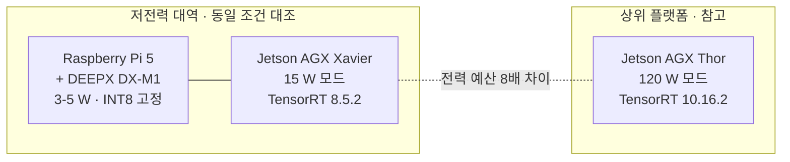
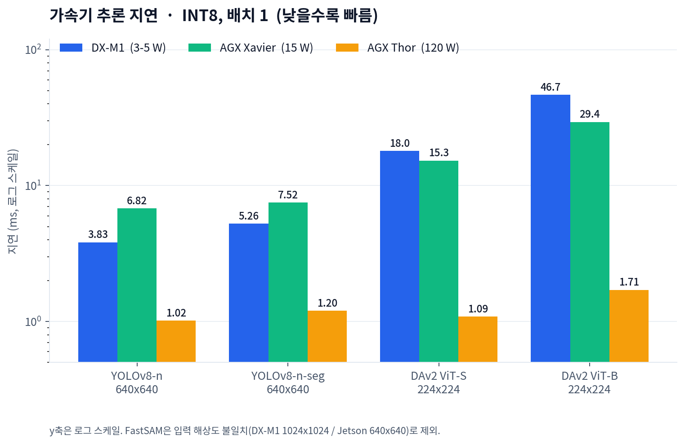
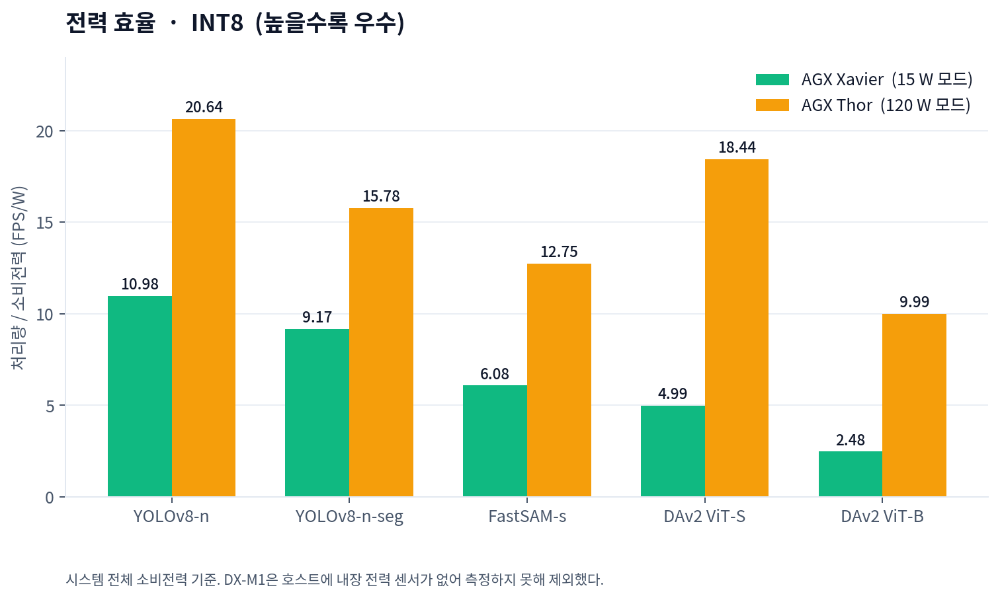
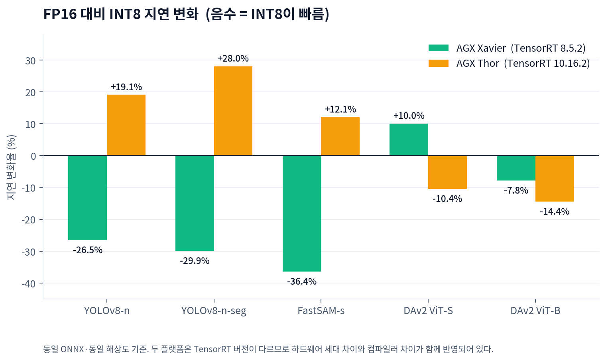
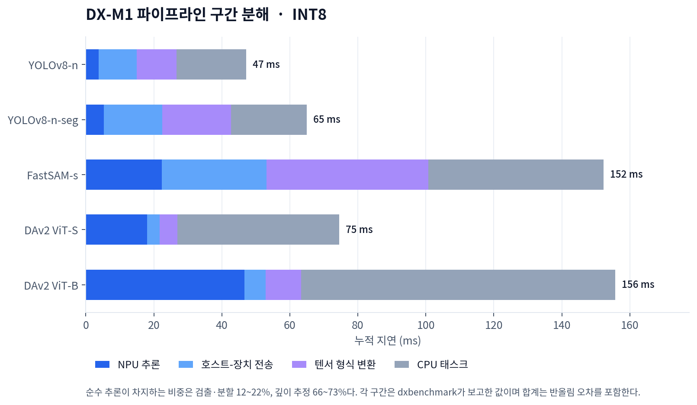
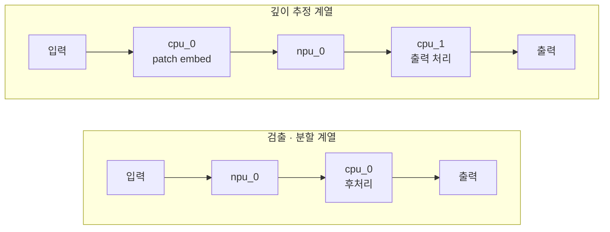
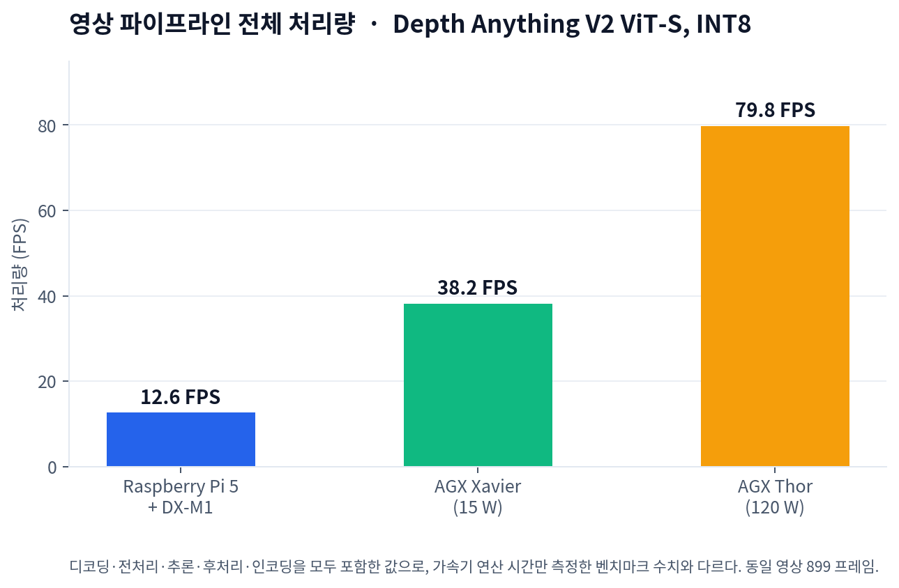
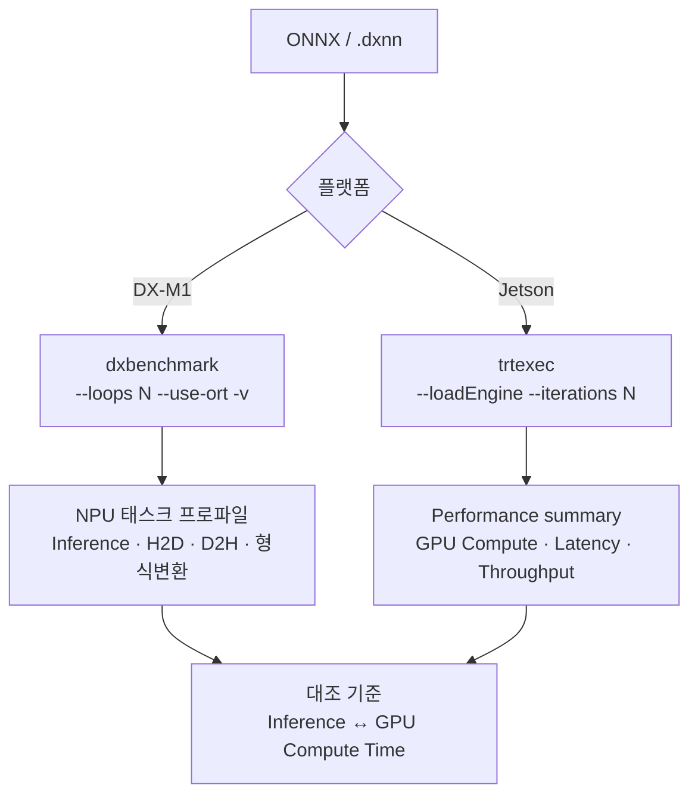

# On-Device Vision Inference Benchmark

**DEEPX DX-M1 · NVIDIA Jetson AGX Xavier · NVIDIA Jetson AGX Thor**

객체 검출 · 인스턴스 분할 · 클래스 무관 분할 · 단안 깊이 추정
5개 모델 × 3개 플랫폼 × 2개 정밀도 실측 기록

[측정 방법](docs/methodology.md) · [모델 출처](docs/models.md) · [환경 구축](docs/setup.md) · [정성 비교](docs/qualitative.md) · [English](en/README.md)

</div>

---

## 목차

| 절 | 내용 |
|---|---|
| [1. 한눈에 보기](#1-한눈에-보기) | 핵심 결과 요약 |
| [2. 측정 대상](#2-측정-대상) | 플랫폼 사양과 모델 |
| [3. 추론 성능](#3-추론-성능) | 지연 · 처리량 |
| [4. 전력 효율](#4-전력-효율) | FPS/W |
| [5. 정밀도의 영향](#5-정밀도의-영향) | FP16 대비 INT8 |
| [6. 파이프라인 구조](#6-파이프라인-구조) | 구간별 지연 분해 |
| [7. 동일 영상 비교](#7-동일-영상-비교) | 결과 영상 |
| [8. 전체 측정값](#8-전체-측정값) | 원본 데이터 |
| [9. 측정 조건과 한계](#9-측정-조건과-한계) | 인용 전 확인 사항 |

---

## 1. 한눈에 보기

### 저전력 대역 — DX-M1 대 Xavier

동일 정밀도(INT8), 동일 입력 해상도, 배치 1 기준이다.

| 작업 | 입력 | DX-M1<br>3–5 W | Xavier<br>15 W | 우위 |
|---|---|---|---|---|
| 객체 검출 | 640×640 | **3.83 ms** | 6.82 ms | DX-M1 **1.78×** |
| 인스턴스 분할 | 640×640 | **5.26 ms** | 7.52 ms | DX-M1 **1.43×** |
| 깊이 추정 ViT-S | 224×224 | 17.99 ms | **15.29 ms** | Xavier 1.18× |
| 깊이 추정 ViT-B | 224×224 | 46.66 ms | **29.38 ms** | Xavier 1.59× |

> **Convolution 계열은 DX-M1이, Transformer 계열은 Xavier가 빠르다.**
> DX-M1은 3–5 W 급 가속기로 15 W 모드 Xavier를 검출·분할에서 앞선다.

### 세 줄 요약

```
① 작업 유형이 우열을 가른다      — conv는 NPU, ViT는 GPU
② DX-M1은 추론 외 구간이 지배적   — 순수 추론 비중 12~22% (검출·분할)
③ INT8이 항상 빠르지는 않다       — Thor에서는 FP16이 더 빠른 경우가 있다
```

---

## 2. 측정 대상

### 2-1. 플랫폼



| | Raspberry Pi 5 + DX-M1 | Jetson AGX Xavier | Jetson AGX Thor |
|---|---|---|---|
| **가속기** | DEEPX DX-M1 (M.2 2280) | Volta GPU, SM 8 | Thor Developer Kit |
| **연산 구성** | NPU 3코어 @ 1000 MHz | 1.377 GHz | — |
| **가속기 메모리** | LPDDR5 5600, 3.92 GiB | 30,990 MiB (256-bit) | 122 GiB |
| **인터페이스** | PCIe Gen3 x1 | — | — |
| **OS** | Debian 13 (trixie) | Ubuntu 20.04.6 LTS | Ubuntu 24.04.4 LTS |
| **SDK** | DXRT v3.4.0 / FW v2.7.4 | JetPack R35.6.4 | JetPack R39.2.0 |
| **CUDA / TensorRT** | — | 11.4 / **8.5.2** | 13.2 / **10.16.2** |
| **전력 모드** | 고정 (선택 불가) | `MODE_15W_DESKTOP` | `120W` |
| **유휴 전력** | 미측정 | 8.23 W | 18.98 – 19.44 W |
| **연산 정밀도** | **INT8 전용** | FP16 / INT8 | FP16 / INT8 |

> **DX-M1은 하드웨어가 INT8 전용이다.** 다른 정밀도를 선택할 수 없으므로, 세 플랫폼을 동일 정밀도로 맞추려면 INT8이 유일한 선택지다.

### 2-2. 모델

| 작업 | 모델 | 입력 | 비고 |
|---|---|---|---|
| 객체 검출 | YOLOv8-n | 640×640 | |
| 인스턴스 분할 | YOLOv8-n-seg | 640×640 | |
| 클래스 무관 분할 | FastSAM-s | DX-M1 1024² / Jetson 640² | 해상도 불일치 |
| 단안 깊이 추정 | Depth Anything V2 ViT-S | 224×224 | |
| 단안 깊이 추정 | Depth Anything V2 ViT-B | 224×224 | |

두 Jetson은 동일한 ONNX 파일을 사용했다. DX-M1은 벤더 사전 컴파일 `.dxnn`을 사용했다. 상세는 [docs/models.md](docs/models.md)에 있다.

---

## 3. 추론 성능

<picture>
  <source media="(prefers-color-scheme: dark)" srcset="assets/latency-int8-dark.png">
  
</picture>

### 3-1. 처리량 (INT8, 배치 1)

| 모델 | DX-M1 | Xavier 15 W | Thor 120 W |
|---|---|---|---|
| YOLOv8-n | — | 137.35 qps | 982.04 qps |
| YOLOv8-n-seg | — | 119.03 qps | 786.08 qps |
| FastSAM-s | — | 79.68 qps | 699.61 qps |
| DAv2 ViT-S | — | 65.08 qps | 893.64 qps |
| DAv2 ViT-B | — | 33.95 qps | 572.20 qps |

`dxbenchmark`는 처리량을 별도로 보고하지 않아 DX-M1 열은 비워두었다. 지연 값은 [8절](#8-전체-측정값)에 있다.

### 3-2. 지연 분포

Jetson 두 플랫폼 모두 p99가 평균의 1.00–1.15배 범위로 안정적이다.

| 플랫폼 | 모델 | 평균 | p99 | p99/평균 |
|---|---|---|---|---|
| Xavier | YOLOv8-n | 6.82 ms | 7.26 ms | 1.06 |
| Xavier | DAv2 ViT-B | 29.38 ms | 29.49 ms | 1.00 |
| Thor | YOLOv8-n | 1.017 ms | 1.082 ms | 1.06 |
| Thor | DAv2 ViT-B | 1.712 ms | 1.896 ms | 1.11 |

`dxbenchmark`는 백분위수를 제공하지 않아 DX-M1의 분포는 동일한 형태로 확인할 수 없었다.

---

## 4. 전력 효율

<picture>
  <source media="(prefers-color-scheme: dark)" srcset="assets/efficiency-int8-dark.png">
  
</picture>

| 플랫폼 | 부하 시 소비전력 | 유휴 |
|---|---|---|
| DX-M1 | **미측정** (칩 스펙 3–5 W) | 미측정 |
| Xavier 15 W | 12.51 – 13.68 W | 8.23 W |
| Thor 120 W | 47.57 – 57.30 W | 18.98 – 19.44 W |

Xavier는 INA3221 전류 합에 입력 전압을 곱해 산출했고, Thor는 INA238이 제공하는 전력값을 직접 읽었다. 두 값 모두 **시스템 전체** 소비 전력이며 가속기 단독 소비가 아니다.

> Raspberry Pi 5에는 내장 전력 센서가 없고 외부 계측기를 확보하지 못해 DX-M1의 전력은 측정하지 못했다. 표에 기재한 3–5 W는 칩 제조사 스펙이며 실측값이 아니다.

---

## 5. 정밀도의 영향

<picture>
  <source media="(prefers-color-scheme: dark)" srcset="assets/precision-effect-dark.png">
  
</picture>

두 Jetson 플랫폼에서 INT8의 효과가 **정반대로** 나타난다.

| 작업 | Xavier | Thor |
|---|---|---|
| 객체 검출 | 26.5% 단축 | 19.1% 증가 |
| 인스턴스 분할 | 29.9% 단축 | 28.0% 증가 |
| 클래스 무관 분할 | 36.4% 단축 | 12.1% 증가 |
| 깊이 추정 ViT-S | 10.0% 증가 | 10.4% 단축 |
| 깊이 추정 ViT-B | 7.8% 단축 | 14.4% 단축 |

**가설** — Thor의 FP16 경로가 충분히 최적화되어 있어, convolution 연산에서는 양자화·역양자화 오버헤드가 INT8 연산 이득을 상회한다. 이번 측정만으로 확정할 수 없으며 연산자 단위 프로파일링이 필요하다.

전력은 두 플랫폼 모두 INT8이 낮다. Thor 기준 FP16 59–83 W, INT8 48–57 W다.

---

## 6. 파이프라인 구조

<picture>
  <source media="(prefers-color-scheme: dark)" srcset="assets/dxm1-breakdown-dark.png">
  
</picture>

DX-M1의 `.dxnn` 모델은 NPU 태스크와 CPU 태스크로 분할되어 있으며, 모델 계열에 따라 구조가 다르다.



### 6-1. 순수 추론이 차지하는 비중

| 모델 | 추론 | NPU 태스크 총계 | 비중 |
|---|---|---|---|
| YOLOv8-n | 3.83 ms | 27.48 ms | **14%** |
| YOLOv8-n-seg | 5.26 ms | 43.77 ms | **12%** |
| FastSAM-s | 22.39 ms | 102.89 ms | **22%** |
| DAv2 ViT-S | 17.99 ms | 27.40 ms | 66% |
| DAv2 ViT-B | 46.66 ms | 63.94 ms | 73% |

검출·분할 모델에서는 D2H 전송과 출력 형식 변환이 추론 시간을 크게 상회한다. YOLOv8-n-seg의 NPU 출력은 10개 텐서 합계 9.19 MB이며, PCIe Gen3 x1 링크에서 D2H에만 13.84 ms가 소요된다.

깊이 추정 모델은 출력 텐서가 작아 이 비중이 낮은 대신, CPU 후처리 태스크가 추론보다 크다(ViT-S 47.27 ms, ViT-B 92.12 ms).

### 6-2. NPU 코어 간 부하

| 모델 | Core 0 | Core 1 | Core 2 |
|---|---|---|---|
| YOLOv8-n | 3.81 ms | 5.76 ms | 5.17 ms |
| YOLOv8-n-seg | 5.23 ms | 8.09 ms | 7.81 ms |
| DAv2 ViT-S | 17.96 ms | 21.29 ms | 21.45 ms |
| DAv2 ViT-B | 46.55 ms | 61.74 ms | 61.25 ms |

Core 0이 일관되게 가장 짧다. 배치 크기 1에서 코어 간 부하 분배가 균등하지 않은 것으로 보이나 원인은 확인하지 못했다.

---


## 7. 동일 영상 비교

동일한 입력 영상 899 프레임을 세 플랫폼에서 각각 처리한 결과다. 모델은 Depth Anything V2 ViT-S (224×224), 정밀도는 INT8로 통일했다.

<table>
<tr>
<th width="25%" align="center">입력 영상</th>
<th width="25%" align="center">Raspberry Pi 5 + DX-M1</th>
<th width="25%" align="center">AGX Xavier · 15 W</th>
<th width="25%" align="center">AGX Thor · 120 W</th>
</tr>
<tr>
### Input Scene / DX-M1

<table>
  <tr>
    <th>Input Scene - RealSense D405 · //15초 · 899 프레임</th>
    <th>Raspberry Pi 5 + DX-M1 12.6 FPS , 추론 75.36 ms</th>
  </tr>
  <tr>
    <td align="center">
      <video src="https://github.com/user-attachments/assets/68399634-362c-4de6-b713-28a0f80fd2a0" width="500" controls></video>
    </td>
    <td align="center">
      <video src="https://github.com/user-attachments/assets/1a9a9362-d7e4-414a-8f29-2a53a2b40882" width="350" controls></video>
    </td>
  </tr>
</table>

### Jetson AGX Xavier / Jetson AGX Thor

<table>
  <tr>
    <th>Jetson AGX Xavier · 15 W   38.2 FPS , 추론 16.83 ms</th>
    <th>Jetson AGX Thor · 120 W   79.8 FPS , 추론 4.20 ms</th>
  </tr>
  <tr>
    <td align="center">
      <video src="https://github.com/user-attachments/assets/4306de66-ffda-47a7-9423-78629c6f7554" width="400" controls></video>
    </td>
    <td align="center">
      <video src="https://github.com/user-attachments/assets/488c422d-9428-4bd1-a837-6ee93866b8ac" width="400" controls></video>
    </td>
  </tr>
</table>
</tr>
<tr>
<td align="center"><sub></sub></td>
<td align="center"><b></b><br><sub></sub></td>
<td align="center"><b></b><br><sub></sub></td>
<td align="center"><b></b><br><sub></sub></td>
</tr>
</table>

<sub></sub>

<picture>
  <source media="(prefers-color-scheme: dark)" srcset="assets/pipeline-fps-dark.png">
  
</picture>

> **이 절의 수치는 3절의 벤치마크와 다르다.** 여기의 FPS는 영상 디코딩·전처리·추론·후처리·인코딩을 모두 포함한 파이프라인 전체 처리량이며, 3절은 가속기 연산 시간만 측정한 값이다. 두 수치를 혼용하면 안 된다. 상세는 [docs/qualitative.md](docs/qualitative.md)에 있다.

### 7-1. INT8 캘리브레이션

이 절의 Jetson 결과는 **캘리브레이션을 적용한** 엔진으로 생성했다.

| 조건 | 출력 품질 | 지연 |
|---|---|---|
| FP16 | 정상 | 3.64 ms |
| INT8 — 캘리브레이션 없음 | **붕괴** (깊이 구분 불가) | 4.05 ms |
| INT8 — 캘리브레이션 적용 | 정상 | 4.20 ms |

<sub>Thor 기준 파이프라인 측정값이다. FP16·무보정 INT8 행은 동일 조건·동일 프레임 수(899)의 별도 촬영본으로 측정했다. 입력 영상의 내용은 추론 시간에 영향을 주지 않음을 별도 대조로 확인했다.</sub>

캘리브레이션은 빌드 시점 작업이므로 **속도에는 영향이 없다.** 다만 깊이 추정은 출력이 연속값이라 활성값 범위 추정이 어긋나면 전체 출력이 좁은 구간에 압축된다.

| 항목 | 내용 |
|---|---|
| 알고리즘 | `IInt8EntropyCalibrator2` (TensorRT 기본) |
| 데이터셋 | 입력 영상에서 10 fps로 추출한 프레임 약 150장 |
| 전처리 | 224×224 리사이즈, ImageNet 평균·표준편차 정규화 |

DX-M1은 벤더 컴파일 시점에 캘리브레이션이 적용되어 있어 별도 처리 없이 정상 출력을 얻었다.

---

## 8. 전체 측정값

플랫폼별 원본 데이터는 아래 문서에 있다. 구간별 min/max/평균/변동계수, 백분위수, 그래프 구조, 텐서 크기가 모두 포함되어 있다.

| 문서 | 내용 |
|---|---|
| [results/dx-m1.md](results/dx-m1.md) | Raspberry Pi 5 + DX-M1 |
| [results/xavier.md](results/xavier.md) | Jetson AGX Xavier (FP16 / INT8) |
| [results/thor.md](results/thor.md) | Jetson AGX Thor (FP16 / INT8) |

### 8-1. 요약 — INT8

| 모델 | 입력 | DX-M1 지연 | Xavier 지연 | Xavier FPS/W | Thor 지연 | Thor FPS/W |
|---|---|---|---|---|---|---|
| YOLOv8-n | 640² | 3.83 ms | 6.82 ms | 10.98 | 1.017 ms | 20.64 |
| YOLOv8-n-seg | 640² | 5.26 ms | 7.52 ms | 9.17 | 1.203 ms | 15.78 |
| FastSAM-s | * | 22.39 ms | 12.55 ms | 6.08 | 1.387 ms | 12.75 |
| DAv2 ViT-S | 224² | 17.99 ms | 15.29 ms | 4.99 | 1.088 ms | 18.44 |
| DAv2 ViT-B | 224² | 46.66 ms | 29.38 ms | 2.48 | 1.712 ms | 9.99 |

<sub>* FastSAM-s는 DX-M1 1024×1024, Jetson 640×640으로 입력 해상도가 다르다. 이 행은 플랫폼 간 비교에 사용할 수 없다.</sub>

### 8-2. 요약 — FP16 (Jetson 전용)

| 모델 | 입력 | Xavier 지연 | Xavier FPS/W | Thor 지연 | Thor FPS/W |
|---|---|---|---|---|---|
| YOLOv8-n | 640² | 9.28 ms | 8.00 | 0.854 ms | 19.11 |
| YOLOv8-n-seg | 640² | 10.72 ms | 6.90 | 0.940 ms | 15.64 |
| FastSAM-s | 640² | 19.74 ms | 3.70 | 1.237 ms | 9.61 |
| DAv2 ViT-S | 224² | 13.90 ms | 5.47 | 1.214 ms | 13.64 |
| DAv2 ViT-B | 224² | 31.87 ms | 2.21 | 1.999 ms | 5.92 |

---

## 9. 측정 조건과 한계

### 9-1. 측정 방식



입력은 합성 데이터 또는 반복 실행이며 카메라를 사용하지 않는다. 카메라를 쓰면 프레임 레이트가 상한으로 작용해 가속기 성능을 측정할 수 없다.

**비교 가능한 항목**

| DX-M1 | Jetson | 대응 |
|---|---|---|
| `Inference` | `GPU Compute Time` | 대응 |
| `H2D` / `D2H` | `H2D` / `D2H Latency` | 대응하나 인터페이스가 다름 |
| `NPU Task (total)` | `Latency` | **비대응** |

`NPU Task (total)`은 형식 변환을 포함하고 `Latency`는 포함하지 않는다.

### 9-2. 한계

| # | 항목 | 내용 |
|---|---|---|
| 1 | **전력 모드 불일치** | DX-M1 3–5 W(고정) / Xavier 15 W / Thor 120 W. 장비 설정 변경 권한이 없어 통일하지 못했다. **Thor를 다른 두 플랫폼과 직접 비교하면 안 된다.** |
| 2 | **TensorRT 버전 차이** | Xavier 8.5.2, Thor 10.16.2. JetPack에 종속되어 변경할 수 없다. 두 Jetson 간 차이에는 하드웨어 세대와 컴파일러 개선이 함께 포함되어 있으며 분리할 수 없다. |
| 3 | **DX-M1 전력 미측정** | 내장 센서 없음. `dxrt-cli`는 전압·온도만 보고하고 전류를 제공하지 않는다. 기재된 3–5 W는 칩 스펙이다. |
| 4 | **벤치마크 INT8 무보정** | 3·5·8절의 Jetson INT8 수치는 캘리브레이션 없이 빌드한 엔진 기준이다. 속도·전력에는 영향이 없으나 **정확도는 보장되지 않는다.** 7절의 영상은 캘리브레이션을 적용해 별도 생성했다. |
| 5 | **FastSAM 해상도 불일치** | DX-M1 1024², Jetson 640². 픽셀 수 2.56배 차이로 플랫폼 간 비교에서 제외했다. |
| 6 | **모델 출처 차이** | DX-M1은 벤더 사전 컴파일, Jetson은 공개 ONNX 자체 빌드. 그래프 범위가 완전히 일치하는지 확인하지 못했다. |
| 7 | **정확도 미측정** | mAP, 깊이 오차 등은 측정 범위에 포함하지 않았다. |
| 8 | **반복 횟수 불일치** | DX-M1 200–500회, Xavier 2000회, Thor 5000회. Thor는 연산 시간이 짧아 동일 횟수에서 측정 구간이 지나치게 짧아지므로 늘렸다. |
| 9 | **열 조건 미통제** | 주변 온도와 방열 조건을 기록하지 않았다. 장시간 실행 시 스로틀링 영향을 배제할 수 없다. |

### 9-3. 재현성 확인

| 플랫폼 | 모델 | 1차 | 2차 | 차이 |
|---|---|---|---|---|
| Xavier | YOLOv8-n FP16 | 9.266 ms | 9.275 ms | 0.1% |
| Thor | YOLOv8-n FP16 | 0.848 ms | 0.854 ms | 0.7% |
| Thor | YOLOv8-n-seg FP16 | 0.928 ms | 0.940 ms | 1.3% |
| Thor | FastSAM-s FP16 | 1.223 ms | 1.237 ms | 1.2% |
| Thor | DAv2 ViT-S FP16 | 1.161 ms | 1.214 ms | 4.6% |
| Thor | DAv2 ViT-B FP16 | 2.007 ms | 1.999 ms | 0.4% |

본문에는 표본이 더 많은 2차 값을 사용했다.

---

## 10. 다음 측정 계획

- [ ] 전력 모드 통일 후 재측정
- [ ] 반복 횟수 통일
- [ ] Raspberry Pi 전력 측정 (외부 계측기 확보 필요)
- [ ] 벤치마크 전 구간에 INT8 캘리브레이션 적용
- [ ] 정확도 평가 (mAP, 깊이 오차)
- [ ] FastSAM 입력 해상도 통일
- [ ] 모델 그래프 범위 대조

---

## 저장소 구성

```
README.md                    본 문서
en/README.md                 English version

docs/
  methodology.md             측정 도구 · 절차 · 비교 조건
  models.md                  모델 출처 · 그래프 구조 · 조건 일치 여부
  setup.md                   환경 구축 절차
  qualitative.md             동일 영상 정성 비교 상세

results/
  dx-m1.md                   Raspberry Pi 5 + DX-M1 원본 측정값
  xavier.md                  Jetson AGX Xavier 원본 측정값
  thor.md                    Jetson AGX Thor 원본 측정값

assets/                      차트 이미지 (light / dark) · 영상 썸네일
media/                       입력 영상 및 결과 영상
```
